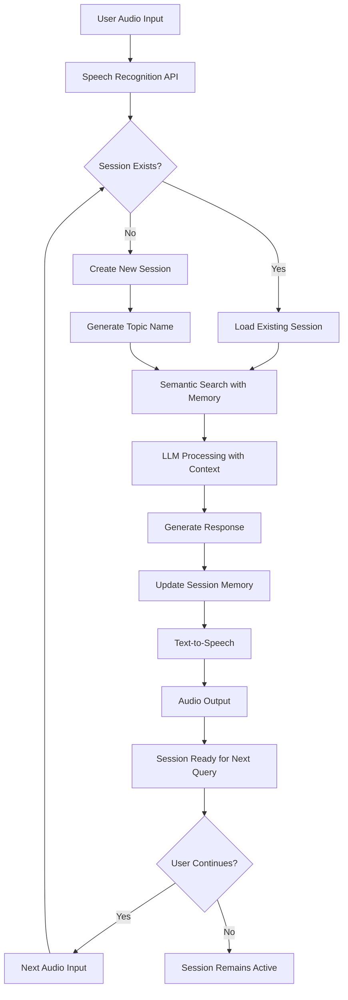

# Complete Voice Assistant Pipeline Guide

## Overview

This guide demonstrates the complete end-to-end pipeline of the Voice Assistant system, from initial user input through session management to final audio output and conversation continuity.

## 🔄 Pipeline Architecture

```
User Input → Speech Recognition → Session Management → Semantic Search → 
Topic Detection → Response Generation → Text-to-Speech → Audio Output → 
Session Update → Ready for Next Query
```

---

## 📋 Complete Flow Diagram



---

## 🚀 Step-by-Step Pipeline Execution

### Phase 1: Initial Setup & User Input

#### Step 1: User Records Audio Query
```javascript
// User records audio through web interface or mobile app
const audioRecorder = new MediaRecorder(stream);
audioRecorder.start();

// When user stops recording
audioRecorder.stop();
audioRecorder.onstop = function() {
    const audioBlob = new Blob(chunks, { type: 'audio/wav' });
    processAudioQuery(audioBlob);
};
```

#### Step 2: Audio Processing Pipeline
```javascript
async function processAudioQuery(audioBlob, sessionId = null) {
    console.log("🎤 Starting complete pipeline...");
    
    try {
        // Phase 1: Speech Recognition
        const speechResult = await speechToText(audioBlob);
        console.log(`📝 Recognized: "${speechResult.recognized_text}"`);
        
        // Phase 2: Session & Semantic Processing
        const searchResult = await processWithSession(
            speechResult.recognized_text, 
            sessionId
        );
        
        // Phase 3: Audio Response Generation
        const audioResponse = await textToSpeech(searchResult.summary);
        console.log("🔊 Audio response generated");
        
        // Phase 4: Update UI and prepare for next query
        updateUI(searchResult);
        playAudioResponse(audioResponse);
        
        return {
            sessionId: searchResult.session_id,
            topic: searchResult.topic_name,
            ready: true
        };
        
    } catch (error) {
        console.error("❌ Pipeline error:", error);
        throw error;
    }
}
```

### Phase 2: Speech Recognition

#### API Call: Convert Audio to Text
```bash
curl -X POST http://localhost:8000/api/v1/speech/recognize \
  -F "audio=@user_query.wav"
```

#### Response:
```json
{
  "status": "success",
  "recognized_text": "How does the transmission work in automatic cars?",
  "confidence_score": 0.94,
  "processing_time_ms": 1150
}
```

#### Implementation:
```javascript
async function speechToText(audioBlob) {
    const formData = new FormData();
    formData.append('audio', audioBlob, 'query.wav');
    
    console.log("🎯 Converting speech to text...");
    
    const response = await fetch('/api/v1/speech/recognize', {
        method: 'POST',
        body: formData
    });
    
    const result = await response.json();
    
    if (result.status === 'success') {
        console.log(`✅ Speech recognized with ${result.confidence_score * 100}% confidence`);
        return result;
    } else {
        throw new Error(`Speech recognition failed: ${result.message}`);
    }
}
```

### Phase 3: Session Management & Topic Detection

#### Scenario A: First Query (New Session)
```bash
# No session_id provided - creates new session
curl -X POST http://localhost:8000/api/v1/search/query \
  -H "Content-Type: application/json" \
  -d '{
    "query": "How does the transmission work in automatic cars?"
  }'
```

#### Response - New Session Created:
```json
{
  "status": "success",
  "query": "How does the transmission work in automatic cars?",
  "summary": "Automatic transmissions use a torque converter and planetary gear sets to change gear ratios without manual clutch engagement. The transmission fluid creates hydraulic pressure that operates clutches and bands to shift gears automatically based on vehicle speed and throttle position.",
  "session_id": "abc123e4-f567-8901-2345-6789abcdef01",
  "topic_name": "Transmission",
  "relevant_chunks": [
    {
      "content": "Automatic transmissions consist of several key components...",
      "metadata": {"source": "transmission_guide.pdf", "page": 15},
      "similarity_score": 0.91
    }
  ],
  "processing_time_ms": 1350,
  "conversation_active": true
}
```

#### Scenario B: Follow-up Query (Existing Session)
```bash
# Using existing session_id for context
curl -X POST http://localhost:8000/api/v1/search/query \
  -H "Content-Type: application/json" \
  -d '{
    "query": "What about the torque converter you mentioned?",
    "session_id": "abc123e4-f567-8901-2345-6789abcdef01"
  }'
```

#### Response - With Context:
```json
{
  "status": "success", 
  "query": "What about the torque converter you mentioned?",
  "summary": "The torque converter I mentioned earlier is a fluid coupling device that replaces the manual clutch in automatic transmissions. It consists of three main elements: the impeller, turbine, and stator. It allows the engine to continue running while the vehicle is stopped and provides torque multiplication during acceleration.",
  "session_id": "abc123e4-f567-8901-2345-6789abcdef01",
  "topic_name": "Transmission",
  "relevant_chunks": [...],
  "processing_time_ms": 980,
  "conversation_active": true
}
```

#### Implementation:
```javascript
async function processWithSession(queryText, sessionId) {
    console.log("🧠 Processing with session context...");
    
    const requestData = {
        query: queryText,
        max_chunks: 5,
        similarity_threshold: 0.7
    };
    
    // Include session ID if available
    if (sessionId) {
        requestData.session_id = sessionId;
        console.log(`🔗 Using existing session: ${sessionId.substring(0, 8)}...`);
    } else {
        console.log("🆕 Creating new session");
    }
    
    const response = await fetch('/api/v1/search/query', {
        method: 'POST',
        headers: { 'Content-Type': 'application/json' },
        body: JSON.stringify(requestData)
    });
    
    const result = await response.json();
    
    if (result.status === 'success') {
        console.log(`📋 Topic: ${result.topic_name}`);
        console.log(`🎯 Session: ${result.session_id.substring(0, 8)}...`);
        return result;
    } else {
        throw new Error(`Search failed: ${result.message}`);
    }
}
```

### Phase 4: Topic Change Detection (Automatic)

#### Scenario C: Topic Change via Keywords
```bash
# User says keywords that trigger new session
curl -X POST http://localhost:8000/api/v1/search/query \
  -H "Content-Type: application/json" \
  -d '{
    "query": "Let me move on to a different topic - how do brakes work?",
    "session_id": "abc123e4-f567-8901-2345-6789abcdef01"
  }'
```

#### Response - New Session Auto-Created:
```json
{
  "status": "success",
  "query": "Let me move on to a different topic - how do brakes work?",
  "summary": "Brakes work by converting the kinetic energy of motion into heat energy through friction. When you press the brake pedal, brake fluid transmits pressure through the brake lines to the brake calipers, which squeeze brake pads against the rotors, creating friction that slows the vehicle.",
  "session_id": "def456-new-brake-session-uuid",
  "topic_name": "Brakes",
  "relevant_chunks": [...],
  "processing_time_ms": 1200,
  "conversation_active": true
}
```

#### Topic Detection Logic:
```javascript
// The API automatically detects these patterns:
const topicChangeKeywords = [
    'new topic', 'different topic', 'change topic',
    'start over', 'new conversation', 'reset',
    'fresh start', 'move on', 'next topic'
];

const automotiveTopics = {
    'engine': ['engine', 'motor', 'combustion', 'cylinder'],
    'transmission': ['transmission', 'gearbox', 'clutch', 'gear'],
    'brakes': ['brake', 'braking', 'pad', 'rotor', 'caliper'],
    'suspension': ['suspension', 'shock', 'strut', 'spring']
};
```

### Phase 5: Text-to-Speech Conversion

#### API Call: Convert Response to Audio
```bash
curl -X POST http://localhost:8000/api/v1/tts/synthesize \
  -H "Content-Type: application/json" \
  -d '{
    "text": "Automatic transmissions use a torque converter and planetary gear sets to change gear ratios without manual clutch engagement.",
    "voice_settings": {
      "rate": 150,
      "volume": 0.8,
      "voice": "default"
    }
  }' \
  --output response_audio.wav
```

#### Implementation:
```javascript
async function textToSpeech(text) {
    console.log("🔊 Converting text to speech...");
    
    const response = await fetch('/api/v1/tts/synthesize', {
        method: 'POST',
        headers: { 'Content-Type': 'application/json' },
        body: JSON.stringify({
            text: text,
            voice_settings: {
                rate: 150,
                volume: 0.8,
                voice: 'default'
            }
        })
    });
    
    if (response.ok) {
        const audioBlob = await response.blob();
        console.log("✅ Audio generated successfully");
        return audioBlob;
    } else {
        throw new Error('Text-to-speech conversion failed');
    }
}
```

### Phase 6: Audio Playback & UI Update

#### Complete UI Integration:
```javascript
function updateUI(searchResult) {
    // Update session info
    document.getElementById('session-id').textContent = 
        searchResult.session_id.substring(0, 8) + '...';
    document.getElementById('topic-name').textContent = searchResult.topic_name;
    
    // Update conversation history
    const historyContainer = document.getElementById('conversation-history');
    const conversationItem = document.createElement('div');
    conversationItem.className = 'conversation-item';
    conversationItem.innerHTML = `
        <div class="query"><strong>Q:</strong> ${searchResult.query}</div>
        <div class="response"><strong>A:</strong> ${searchResult.summary}</div>
        <div class="metadata">
            Topic: ${searchResult.topic_name} | 
            Time: ${searchResult.processing_time_ms}ms
        </div>
    `;
    historyContainer.appendChild(conversationItem);
    
    // Show relevant chunks if needed
    displayRelevantChunks(searchResult.relevant_chunks);
}

async function playAudioResponse(audioBlob) {
    console.log("🎵 Playing audio response...");
    
    const audio = new Audio(URL.createObjectURL(audioBlob));
    
    // Show audio controls
    const audioPlayer = document.getElementById('audio-player');
    audioPlayer.src = audio.src;
    audioPlayer.style.display = 'block';
    
    // Auto-play response
    try {
        await audio.play();
        console.log("✅ Audio playback started");
    } catch (error) {
        console.log("⚠️ Auto-play blocked, user must click play");
    }
    
    // Cleanup when done
    audio.onended = () => {
        URL.revokeObjectURL(audio.src);
        console.log("🏁 Audio playback completed");
    };
}
```

---

## 🔄 Complete Implementation Example

### Full Pipeline Class
```javascript
class VoiceAssistantPipeline {
    constructor(baseUrl = 'http://localhost:8000/api/v1') {
        this.baseUrl = baseUrl;
        this.currentSession = null;
        this.conversationHistory = [];
    }
    
    // Main pipeline method
    async processVoiceQuery(audioBlob) {
        console.log("🚀 Starting complete voice pipeline...");
        
        try {
            // Step 1: Speech Recognition
            const speechResult = await this.speechToText(audioBlob);
            console.log(`📝 Recognized: "${speechResult.recognized_text}"`);
            
            // Step 2: Process with conversation context
            const searchResult = await this.searchWithContext(speechResult.recognized_text);
            console.log(`📋 Topic: ${searchResult.topic_name}`);
            
            // Step 3: Generate audio response
            const audioResponse = await this.textToSpeech(searchResult.summary);
            console.log("🔊 Audio response generated");
            
            // Step 4: Update session and UI
            this.updateSession(searchResult);
            this.updateConversationHistory(searchResult);
            
            // Step 5: Play response
            await this.playAudioResponse(audioResponse);
            
            console.log("✅ Pipeline completed successfully");
            
            return {
                success: true,
                sessionId: this.currentSession.id,
                topic: this.currentSession.topic,
                response: searchResult.summary
            };
            
        } catch (error) {
            console.error("❌ Pipeline failed:", error);
            return { success: false, error: error.message };
        }
    }
    
    // Speech recognition
    async speechToText(audioBlob) {
        const formData = new FormData();
        formData.append('audio', audioBlob, 'query.wav');
        
        const response = await fetch(`${this.baseUrl}/speech/recognize`, {
            method: 'POST',
            body: formData
        });
        
        const result = await response.json();
        if (result.status !== 'success') {
            throw new Error(`Speech recognition failed: ${result.message}`);
        }
        
        return result;
    }
    
    // Semantic search with session context
    async searchWithContext(queryText) {
        const requestData = {
            query: queryText,
            max_chunks: 5,
            similarity_threshold: 0.7
        };
        
        // Include current session if exists
        if (this.currentSession) {
            requestData.session_id = this.currentSession.id;
        }
        
        const response = await fetch(`${this.baseUrl}/search/query`, {
            method: 'POST',
            headers: { 'Content-Type': 'application/json' },
            body: JSON.stringify(requestData)
        });
        
        const result = await response.json();
        if (result.status !== 'success') {
            throw new Error(`Search failed: ${result.message}`);
        }
        
        return result;
    }
    
    // Text-to-speech conversion
    async textToSpeech(text) {
        const response = await fetch(`${this.baseUrl}/tts/synthesize`, {
            method: 'POST',
            headers: { 'Content-Type': 'application/json' },
            body: JSON.stringify({
                text: text,
                voice_settings: {
                    rate: 150,
                    volume: 0.8,
                    voice: 'default'
                }
            })
        });
        
        if (!response.ok) {
            throw new Error('Text-to-speech conversion failed');
        }
        
        return await response.blob();
    }
    
    // Update session information
    updateSession(searchResult) {
        // Check if session changed (topic change detection)
        if (!this.currentSession || this.currentSession.id !== searchResult.session_id) {
            console.log(`🔄 Session changed: ${searchResult.topic_name}`);
            this.currentSession = {
                id: searchResult.session_id,
                topic: searchResult.topic_name,
                createdAt: new Date()
            };
        }
    }
    
    // Update conversation history
    updateConversationHistory(searchResult) {
        this.conversationHistory.push({
            query: searchResult.query,
            response: searchResult.summary,
            topic: searchResult.topic_name,
            sessionId: searchResult.session_id,
            timestamp: new Date(),
            processingTime: searchResult.processing_time_ms
        });
        
        // Keep only last 10 conversations
        if (this.conversationHistory.length > 10) {
            this.conversationHistory = this.conversationHistory.slice(-10);
        }
    }
    
    // Play audio response
    async playAudioResponse(audioBlob) {
        const audio = new Audio(URL.createObjectURL(audioBlob));
        
        return new Promise((resolve, reject) => {
            audio.onended = () => {
                URL.revokeObjectURL(audio.src);
                resolve();
            };
            
            audio.onerror = () => {
                reject(new Error('Audio playback failed'));
            };
            
            audio.play().catch(error => {
                console.warn('Auto-play blocked:', error);
                // Still resolve as user can manually play
                resolve();
            });
        });
    }
    
    // Manual session management
    async createNewSession(topicName) {
        const response = await fetch(`${this.baseUrl}/search/conversation/new`, {
            method: 'POST',
            headers: { 'Content-Type': 'application/json' },
            body: JSON.stringify({ topic_name: topicName })
        });
        
        const result = await response.json();
        if (result.status === 'success') {
            this.currentSession = {
                id: result.session_id,
                topic: result.topic_name,
                createdAt: new Date()
            };
            console.log(`🆕 New session created: ${topicName}`);
        }
        
        return result;
    }
    
    // Reset current session
    async resetSession(newTopicName) {
        const response = await fetch(`${this.baseUrl}/search/conversation/reset`, {
            method: 'POST',
            headers: { 'Content-Type': 'application/json' },
            body: JSON.stringify({
                session_id: this.currentSession?.id,
                topic_name: newTopicName
            })
        });
        
        const result = await response.json();
        if (result.status === 'success') {
            this.currentSession = {
                id: result.new_session_id,
                topic: result.topic_name,
                createdAt: new Date()
            };
            this.conversationHistory = []; // Clear history
            console.log(`🔄 Session reset: ${newTopicName}`);
        }
        
        return result;
    }
    
    // Get session information
    getSessionInfo() {
        return {
            currentSession: this.currentSession,
            conversationHistory: this.conversationHistory,
            historyCount: this.conversationHistory.length
        };
    }
}
```

---

## 🎯 Usage Examples

### Example 1: Complete Conversation Flow
```javascript
// Initialize pipeline
const voiceAssistant = new VoiceAssistantPipeline();

// Set up audio recording
let mediaRecorder;
let audioChunks = [];

navigator.mediaDevices.getUserMedia({ audio: true })
    .then(stream => {
        mediaRecorder = new MediaRecorder(stream);
        
        mediaRecorder.ondataavailable = event => {
            audioChunks.push(event.data);
        };
        
        mediaRecorder.onstop = async () => {
            const audioBlob = new Blob(audioChunks, { type: 'audio/wav' });
            audioChunks = [];
            
            // Process through complete pipeline
            const result = await voiceAssistant.processVoiceQuery(audioBlob);
            
            if (result.success) {
                console.log(`✅ Query processed in topic: ${result.topic}`);
                displaySessionInfo(voiceAssistant.getSessionInfo());
            } else {
                console.error(`❌ Processing failed: ${result.error}`);
            }
        };
    });

// Recording controls
function startRecording() {
    console.log("🎤 Recording started...");
    mediaRecorder.start();
    document.getElementById('record-btn').textContent = 'Stop Recording';
}

function stopRecording() {
    console.log("🛑 Recording stopped");
    mediaRecorder.stop();
    document.getElementById('record-btn').textContent = 'Start Recording';
}

// Display session information
function displaySessionInfo(sessionInfo) {
    const sessionDisplay = document.getElementById('session-info');
    sessionDisplay.innerHTML = `
        <h3>Current Session</h3>
        <p><strong>Topic:</strong> ${sessionInfo.currentSession?.topic || 'None'}</p>
        <p><strong>Session ID:</strong> ${sessionInfo.currentSession?.id?.substring(0, 8) || 'None'}...</p>
        <p><strong>History Count:</strong> ${sessionInfo.historyCount}</p>
        
        <h4>Recent Conversations:</h4>
        <ul>
            ${sessionInfo.conversationHistory.slice(-3).map(conv => `
                <li>
                    <strong>Q:</strong> ${conv.query.substring(0, 50)}...<br>
                    <strong>A:</strong> ${conv.response.substring(0, 100)}...<br>
                    <em>Topic: ${conv.topic} | ${conv.processingTime}ms</em>
                </li>
            `).join('')}
        </ul>
    `;
}
```

### Example 2: Multi-Topic Conversation Demo
```javascript
async function demonstrateMultiTopicConversation() {
    const assistant = new VoiceAssistantPipeline();
    
    console.log("🎭 Starting multi-topic conversation demo...");
    
    // Simulate audio queries with text (for demo purposes)
    const queries = [
        "How does the engine work?",
        "What are the main components you mentioned?", 
        "How does the fuel injection system work?",
        "Let me move on to a different topic - how do brakes work?",
        "What about the brake pads you mentioned?",
        "Now let's talk about suspension systems"
    ];
    
    for (let i = 0; i < queries.length; i++) {
        console.log(`\n--- Query ${i + 1}: "${queries[i]}" ---`);
        
        // Simulate the complete pipeline (without actual audio)
        try {
            const searchResult = await assistant.searchWithContext(queries[i]);
            assistant.updateSession(searchResult);
            assistant.updateConversationHistory(searchResult);
            
            console.log(`📋 Topic: ${searchResult.topic_name}`);
            console.log(`🆔 Session: ${searchResult.session_id.substring(0, 8)}...`);
            console.log(`💬 Response: ${searchResult.summary.substring(0, 100)}...`);
            
        } catch (error) {
            console.error(`❌ Query ${i + 1} failed:`, error);
        }
        
        // Brief delay between queries
        await new Promise(resolve => setTimeout(resolve, 1000));
    }
    
    // Display final session state
    const sessionInfo = assistant.getSessionInfo();
    console.log("\n🏁 Final Session State:");
    console.log(`Topics covered: ${[...new Set(sessionInfo.conversationHistory.map(h => h.topic))].join(', ')}`);
    console.log(`Total conversations: ${sessionInfo.historyCount}`);
    console.log(`Current topic: ${sessionInfo.currentSession?.topic}`);
}

// Run the demo
demonstrateMultiTopicConversation();
```

### Example 3: Error Handling & Recovery
```javascript
class RobustVoiceAssistant extends VoiceAssistantPipeline {
    async processVoiceQueryWithRetry(audioBlob, maxRetries = 3) {
        let lastError;
        
        for (let attempt = 1; attempt <= maxRetries; attempt++) {
            try {
                console.log(`🔄 Attempt ${attempt}/${maxRetries}`);
                
                const result = await this.processVoiceQuery(audioBlob);
                
                if (result.success) {
                    console.log(`✅ Succeeded on attempt ${attempt}`);
                    return result;
                }
                
                lastError = new Error(result.error);
                
            } catch (error) {
                console.error(`❌ Attempt ${attempt} failed:`, error.message);
                lastError = error;
                
                // Wait before retry (exponential backoff)
                if (attempt < maxRetries) {
                    const delay = Math.pow(2, attempt) * 1000;
                    console.log(`⏳ Waiting ${delay}ms before retry...`);
                    await new Promise(resolve => setTimeout(resolve, delay));
                }
            }
        }
        
        console.error(`💥 All ${maxRetries} attempts failed`);
        throw lastError;
    }
    
    async gracefulErrorHandling(error, context) {
        console.error(`🚨 Error in ${context}:`, error);
        
        // Different handling for different error types
        if (error.message.includes('Speech recognition')) {
            return {
                success: false,
                error: 'Could not understand audio. Please try speaking more clearly.',
                suggestion: 'Check microphone and speak clearly'
            };
        } else if (error.message.includes('Search failed')) {
            return {
                success: false,
                error: 'Could not find relevant information.',
                suggestion: 'Try rephrasing your question'
            };
        } else if (error.message.includes('Text-to-speech')) {
            return {
                success: false,
                error: 'Could not generate audio response.',
                suggestion: 'Response is available as text'
            };
        } else {
            return {
                success: false,
                error: 'An unexpected error occurred.',
                suggestion: 'Please try again'
            };
        }
    }
}
```

---

## 🔧 Performance Monitoring

### Pipeline Metrics Collection
```javascript
class MetricsCollector {
    constructor() {
        this.metrics = [];
    }
    
    startTimer(operation) {
        return {
            operation,
            startTime: performance.now(),
            end: () => {
                const duration = performance.now() - this.startTime;
                this.metrics.push({
                    operation,
                    duration,
                    timestamp: new Date()
                });
                return duration;
            }
        };
    }
    
    getAverageTime(operation) {
        const operationMetrics = this.metrics.filter(m => m.operation === operation);
        if (operationMetrics.length === 0) return 0;
        
        const total = operationMetrics.reduce((sum, m) => sum + m.duration, 0);
        return total / operationMetrics.length;
    }
    
    getReport() {
        const operations = [...new Set(this.metrics.map(m => m.operation))];
        
        return operations.map(op => ({
            operation: op,
            averageTime: Math.round(this.getAverageTime(op)),
            totalCalls: this.metrics.filter(m => m.operation === op).length
        }));
    }
}

// Usage in pipeline
class MonitoredVoiceAssistant extends VoiceAssistantPipeline {
    constructor(baseUrl) {
        super(baseUrl);
        this.metrics = new MetricsCollector();
    }
    
    async processVoiceQuery(audioBlob) {
        const pipelineTimer = this.metrics.startTimer('complete_pipeline');
        
        try {
            // Speech Recognition with timing
            const speechTimer = this.metrics.startTimer('speech_recognition');
            const speechResult = await this.speechToText(audioBlob);
            speechTimer.end();
            
            // Semantic Search with timing
            const searchTimer = this.metrics.startTimer('semantic_search');
            const searchResult = await this.searchWithContext(speechResult.recognized_text);
            searchTimer.end();
            
            // Text-to-Speech with timing
            const ttsTimer = this.metrics.startTimer('text_to_speech');
            const audioResponse = await this.textToSpeech(searchResult.summary);
            ttsTimer.end();
            
            // Update session
            this.updateSession(searchResult);
            this.updateConversationHistory(searchResult);
            
            // Play response
            const playTimer = this.metrics.startTimer('audio_playback');
            await this.playAudioResponse(audioResponse);
            playTimer.end();
            
            const totalTime = pipelineTimer.end();
            
            console.log(`⏱️ Pipeline completed in ${Math.round(totalTime)}ms`);
            console.log("📊 Performance Report:", this.metrics.getReport());
            
            return {
                success: true,
                sessionId: this.currentSession.id,
                topic: this.currentSession.topic,
                response: searchResult.summary,
                performanceMetrics: {
                    totalTime: Math.round(totalTime),
                    breakdown: this.metrics.getReport()
                }
            };
            
        } catch (error) {
            pipelineTimer.end();
            throw error;
        }
    }
}
```

---

## 🎯 Best Practices & Tips

### 1. Session Management
- ✅ Always include `session_id` for follow-up queries
- ✅ Monitor session topic changes automatically
- ✅ Implement session cleanup for memory management
- ✅ Handle session expiration gracefully

### 2. Error Handling
- ✅ Implement retry logic with exponential backoff
- ✅ Provide user-friendly error messages
- ✅ Fall back to text responses if audio fails
- ✅ Log errors for debugging and monitoring

### 3. Performance Optimization
- ✅ Monitor pipeline timing and bottlenecks
- ✅ Implement audio streaming for large responses
- ✅ Cache frequently requested content
- ✅ Use appropriate audio formats and quality

### 4. User Experience
- ✅ Provide visual feedback during processing
- ✅ Show conversation history and context
- ✅ Allow manual session management
- ✅ Implement proper loading states

---

## 🚀 Ready to Deploy

This complete pipeline provides:

- **🎤 Audio Input Processing** with speech recognition
- **🧠 Intelligent Session Management** with topic detection
- **💬 Contextual Conversations** with memory persistence
- **🔊 Audio Response Generation** with text-to-speech
- **📊 Performance Monitoring** and error handling
- **🔄 Continuous Flow** ready for next user input

The system is now ready for production deployment with full conversation continuity, automatic topic detection, and comprehensive error handling!